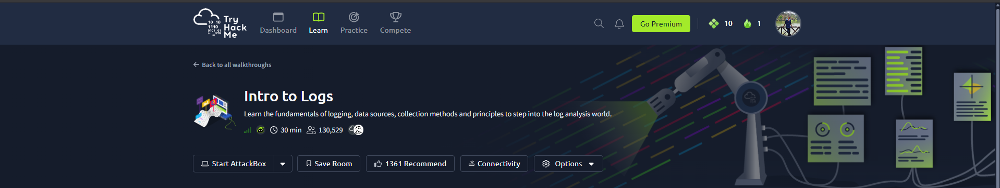
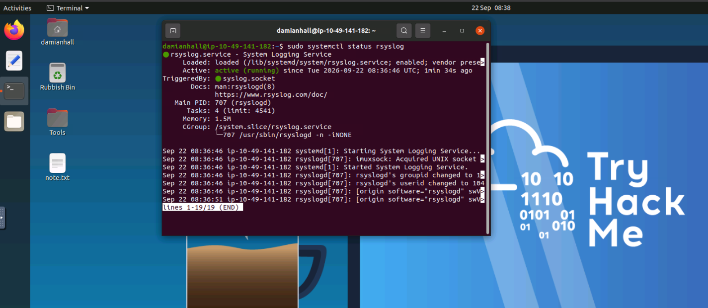
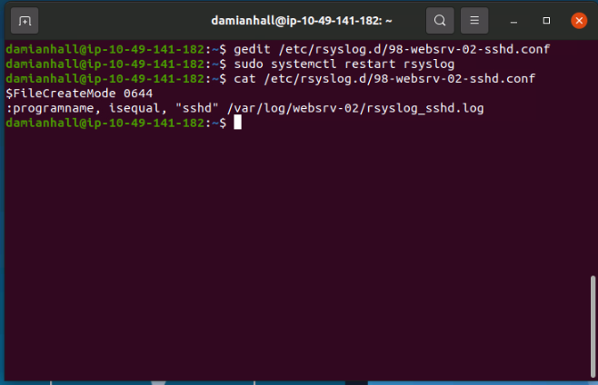
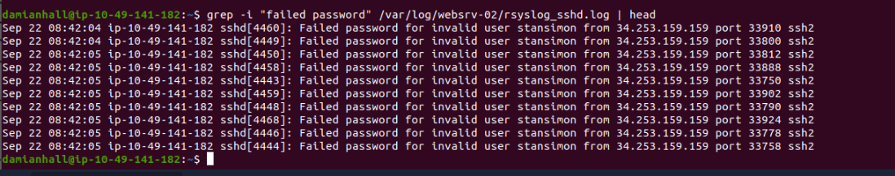
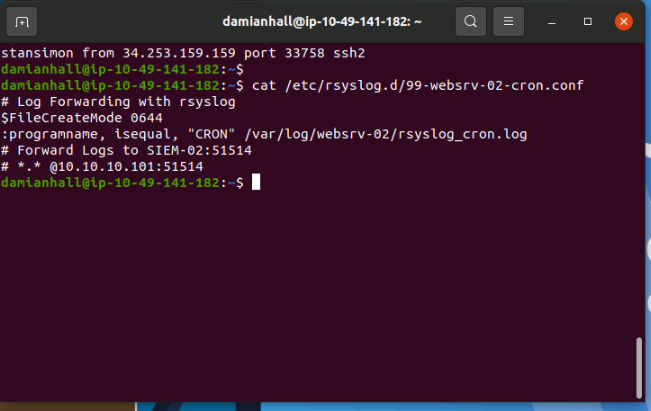
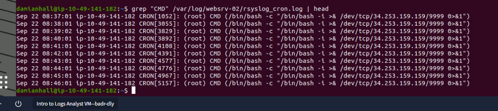
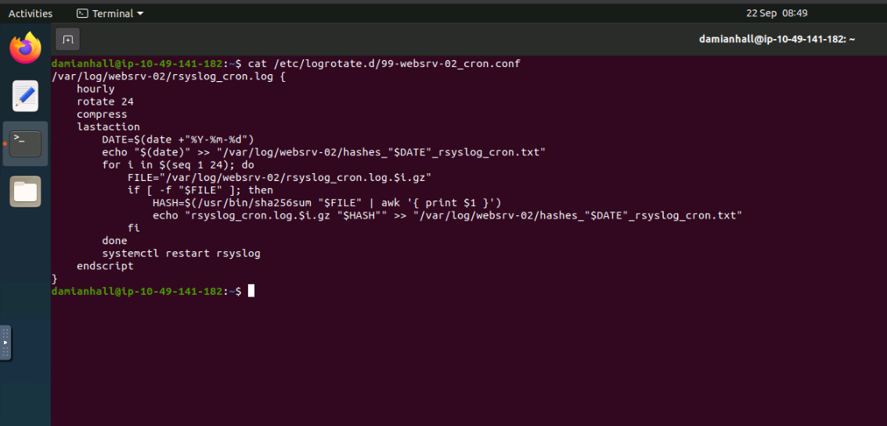
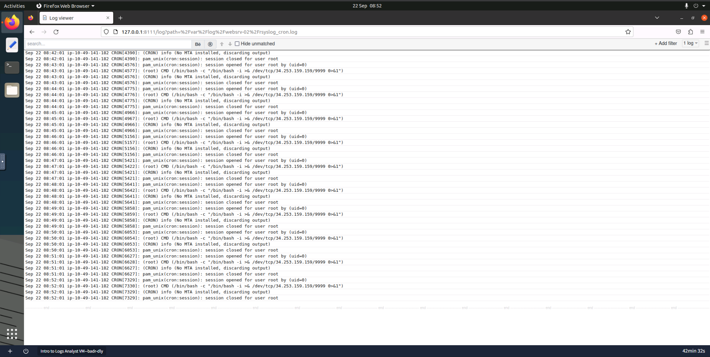
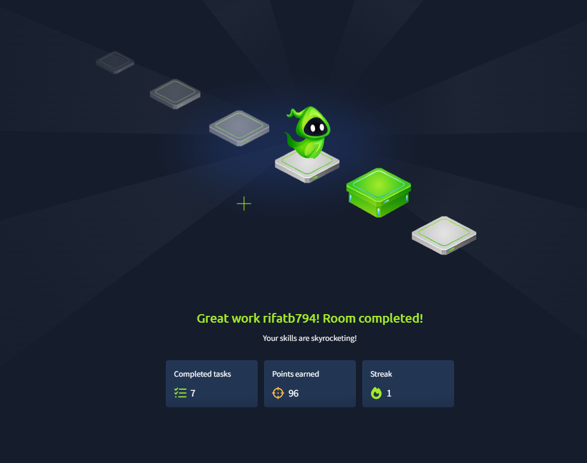

# TryHackMe — Intro to Logs

> A practical SOC and Blue Team report about collecting, managing, and analysing logs.


**Author:** Rifat Bin Tayub  
**Room:** [Intro to Logs](https://tryhackme.com/room/introtologs)  
**Category:** Log Analysis / Incident Detection  
**Completion:** 7 tasks completed

---

## Executive Summary

In this lab, I learned how security teams collect, store, and analyse logs.

I used `rsyslog` to collect SSH and CRON logs in separate files. I then checked the logs and found:

- Many failed SSH login attempts from one IP address.
- A suspicious CRON job running as the `root` user.
- The CRON job tried to connect back to the same IP address every minute.

Together, these events show signs of an attack and a persistence method.

---

## What I Learned

- Common log types and formats.
- How `rsyslog` collects Linux logs.
- How to find failed SSH login attempts.
- How to detect a suspicious CRON job.
- How logs are sent to a SIEM.
- How `logrotate` manages old logs.
- How to view and filter logs in a Log Viewer.
- How to connect related events from different logs.

---

## Lab Tools

| Tool | Simple Purpose |
|---|---|
| TryHackMe Linux VM | Safe environment for the lab |
| `rsyslog` | Collects and saves logs |
| `systemctl` | Checks or restarts a service |
| `cat` | Displays a file |
| `grep` | Finds specific text in logs |
| `logrotate` | Rotates and compresses old logs |
| Log Viewer | Displays and filters logs in a browser |
| SHA-256 | Helps check whether a log file was changed |

---

## Steps I Followed

1. Read the main log concepts in the room.
2. Checked that the `rsyslog` service was running.
3. Created a separate file for SSH logs.
4. Searched the SSH log for failed logins.
5. Checked the CRON logging and SIEM settings.
6. Searched CRON logs for suspicious commands.
7. Reviewed the log rotation settings.
8. Viewed the CRON logs in the Log Viewer.
9. Recorded the findings and security actions.

---

## Evidence and Analysis

### 1. Room Overview

This room teaches the basics of log collection, storage, management, and analysis.



### 2. Checking the Logging Service

First, I checked the `rsyslog` service. The result showed **active (running)**. This means the logging service was working correctly.



### 3. Collecting SSH Logs

I created an `rsyslog` rule for the SSH service (`sshd`). The rule saves SSH events in this file:

```text
/var/log/websrv-02/rsyslog_sshd.log
```

After saving the rule, I restarted `rsyslog` so the new setting could work.



### 4. Finding Failed SSH Logins

I searched the SSH log for `Failed password` events.

The log showed many failed login attempts for the invalid user `stansimon`. All attempts came from `34.253.159.159` within a short time.

This pattern may be an automated brute-force attack.



### 5. Checking CRON Logs and SIEM Settings

The CRON configuration saves events in this file:

```text
/var/log/websrv-02/rsyslog_cron.log
```

The configuration also shows a SIEM server at `10.10.10.101:51514`. However, the forwarding line starts with `#`, so it is currently disabled.



### 6. Finding Suspicious CRON Activity

The CRON log showed a dangerous command running as `root` every minute.

The command tried to create a reverse-shell connection to `34.253.159.159` on port `9999`. A reverse shell can give an attacker remote control of a system.

Because the command runs every minute, it also acts as persistence. This means the attacker keeps trying to regain access.



### 7. Checking Log Rotation

I reviewed the CRON `logrotate` settings:

| Setting | Easy Meaning |
|---|---|
| `hourly` | Creates a new log copy every hour |
| `rotate 24` | Keeps 24 old copies |
| `compress` | Makes old logs smaller |
| `sha256sum` | Creates a hash to check file integrity |
| Restart `rsyslog` | Applies logging again after rotation |

These settings help control storage and protect log evidence.



### 8. Viewing Logs in the Browser

I opened the CRON log in the browser-based Log Viewer. It made the repeated activity easy to see and review.



### 9. Room Completion

I completed all seven tasks in the room.



---

## Main Findings

| Finding | Why It Matters | Risk |
|---|---|---|
| Many failed SSH logins | May show a brute-force attack | Medium |
| One IP made all login attempts | Shows a clear attack source | High |
| Root CRON job started a reverse shell | May give an attacker remote control | Critical |
| Command ran every minute | Shows an automatic persistence method | Critical |
| SIEM forwarding was disabled | Security events may not reach the SIEM | Medium |

> All IP addresses and events in this report came from an authorised TryHackMe lab.

---

## How the Events Are Connected

The same external IP appeared in two different logs:

1. It made many failed SSH login attempts.
2. A root CRON job tried to connect back to it.
3. The CRON job repeated every minute.

One log alone gives only part of the story. Connecting the SSH and CRON logs gives a clearer view of the possible attack.

---

## Recommended Security Actions

- Remove the suspicious CRON job.
- Block the malicious IP address when appropriate.
- Block the suspicious outbound connection.
- Reset affected passwords and review SSH keys.
- Check successful SSH logins and root activity.
- Enable log forwarding to the SIEM.
- Create alerts for repeated failed logins.
- Create alerts for suspicious shell commands.
- Keep copies and hashes of important logs.
- Patch and review the affected server.

---

## Skills Demonstrated

- Linux log analysis
- `rsyslog` configuration
- Log filtering with `grep`
- SSH brute-force detection
- CRON persistence detection
- Basic incident investigation
- SIEM forwarding awareness
- Log rotation and integrity checking
- Security report writing

---

## Easy Log Analysis Terms

| Term | Easy Meaning |
|---|---|
| Parsing | Break a log into useful parts |
| Normalisation | Put different logs into one standard format |
| Enrichment | Add helpful details, such as IP reputation |
| Correlation | Connect related events from different logs |
| Visualisation | Show log data in an easy-to-read view |
| Reporting | Explain what happened and what to do next |

---

## Conclusion

This lab showed how logs help security teams find an attack. By collecting SSH and CRON logs, filtering important events, and connecting related evidence, I found signs of brute-force activity and a persistence method.

The lab improved my practical skills in Linux logging, SOC investigation, and incident reporting.

---

## Disclaimer

This report is based on an authorised TryHackMe training lab. It is for education, portfolio use, and defensive security learning only.
